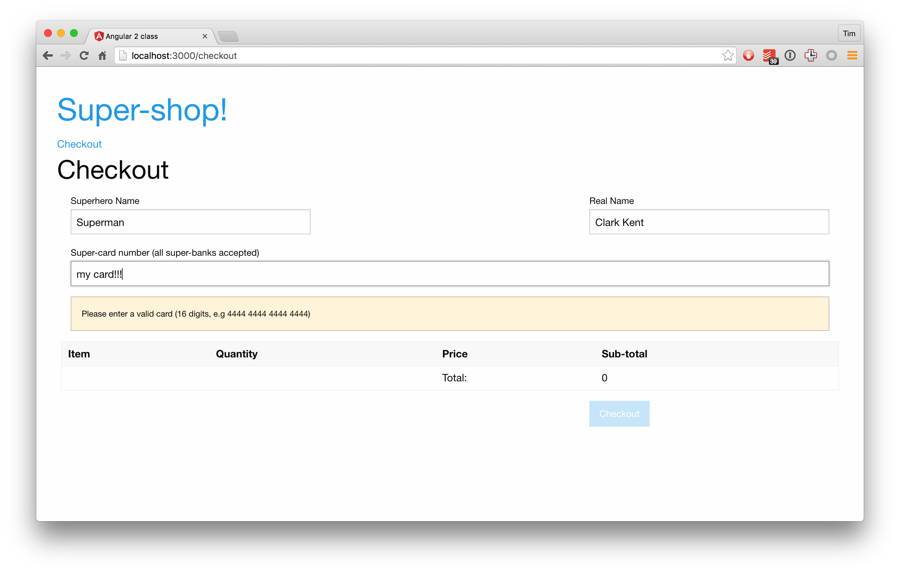

# Forms

We want to accept payment using Angular's form system.

## Steps

1. We want to create a `Checkout` component
  1. Copy across the `pre-written/Checkout.component.html` to the app folder
1. First let's create a route for our Checkout
  1. You know how to do this :)
1. In the `Checkout` component, we want to create our form
  1. I've written the HTML for you as HTML is not what we're here to learn
  1. It's your job to wire it up with Angular
1. We want to ensure the data we create is valid
  1. Ensure all the fields are required
  1. Disable the checkout button until the form is valid
1. We also need to show our users what went wrong
  1. The card-number input has a HTML 5 pattern attribute
  1. Angular will use this to make the number control invalid
  1. We need to get a reference to the control for the card-number and reveal the error message only when it's invalid
  1. Use this to toggle the `error` class on the `
` surrounding the card-number input
1. Let's handle the submission of the form
  1. Use the `ngSubmit` event and pass it to handled
  1. Format the `form.value` as JSON, and store it on the component
  1. Display the submitted data somewhere on the form
1. Woohoo! We built a credit-card form that isn't terrible

## Resources

- [Cheatsheet](https://angular.io/docs/ts/latest/cheatsheet.html)

## Goal

