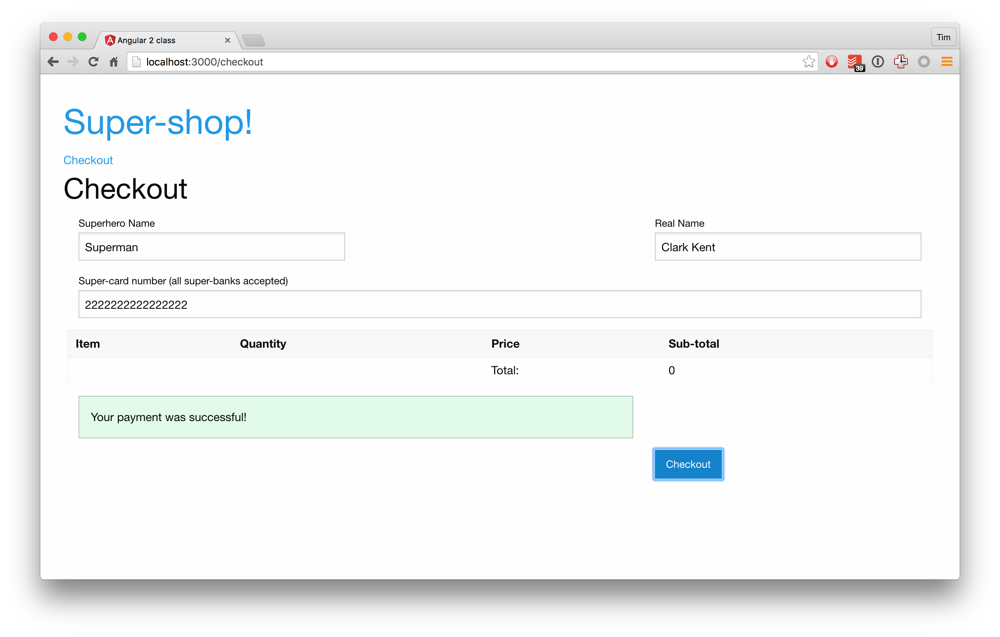

# HTTP

## Steps

1. creating a service to talk to our server
  1. copy the `pre-written/Payment` class over and import it
  1. you'll note we need to import HTTP
  1. also - what do we need to ensure is available at the top level of our app?
    1. `HTTP_PROVIDERS`! They live in `@angular/http'
  1. we also need our `API_URL`
    1. the token for this is in `types`
    1. use `{provide: API_URL, useValue: "http://localhost:3999"}`
  1. inject `Http` and `API_URL` into Payment, and implement it using Angular's `http` module

    1. the successful endpoint is `API_URL + "/test/checkout/success"`
    1. the failed endpoint is `API_URL + "/test/checkout/failure"`
1. checkout
  1. we want to use our payment class on submit now
  1. pass the submitted form value to payment success or failure
  1. explain to the user what's going on
    1. update the template to display a loading message once we start submit
    1. display a success message on success
    1. display a failure message on failure

## Goal

